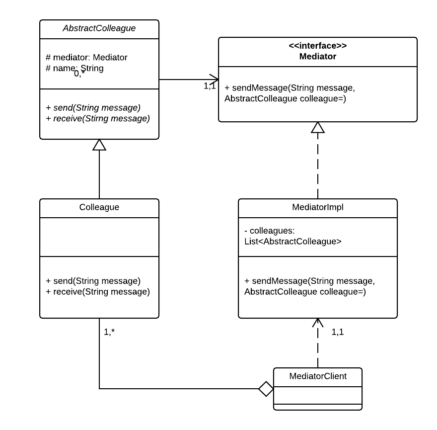

### Mediator Pattern

#### A behavioral pattern

Allow loose coupling by encapsulating the way disparate sets of objects interact and communicate with each other. Allows for the actions of each object set to vary independently of one another.

Source code stems from the following UML diagram:

